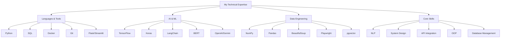

# 🚀 Rahul Samant-Portfolio
### Data Scientist & Python Developer

## 🎯 About Me
Innovative Data Scientist and Python Developer specializing in AI-powered automation and advanced web scraping solutions. Currently pursuing B.Tech in Computer Science Engineering at Punjab Engineering College, Chandigarh. I transform complex data challenges into scalable, high-performance solutions that deliver measurable impact.

## 💫 Why Work With Me?

- 🔬 **Innovation Driver**: Demonstrated ability to boost system performance and efficiency, achieving up to 87% improvement in search relevancy scores
- 🛠️ **Technical Excellence**: Deep expertise in Python, AI/ML, and data engineering with proven results
- 📈 **Performance Focused**: Track record of optimizing systems (30% faster scraping, 99.9% uptime)
- 🤝 **Collaborative Spirit**: Active open-source contributor (Gradio, Wagtail) and Hacktoberfest achiever
- 🎓 **Continuous Learner**: Selected among top 25 candidates for IIT Kharagpur's Data Science program

## 🛠️ Tech Stack

## 🏆 Key Projects

### AI Research Assistant
- 📊 95% search accuracy
- 🚀 40% faster query responses
- 💪 Handles 1000+ concurrent searches
- 🎯 99.9% uptime achievement

### Neural Machine Translation System
- 🎯 90%+ translation accuracy
- 📚 20,000 training samples
- 🧠 Advanced LSTM architecture
- 🔄 Bidirectional processing

## 📈 Impact By Numbers
- 30% faster web scraping performance
- 99% accuracy in data extraction
- 20% reduction in manual data collection time
- 87% improvement in search relevancy
- 65% reduction in query latency

## 🤝 Let's Connect
I'm always open to discussing new opportunities, tech innovations, or potential collaborations. Feel free to reach out through any of the channels above!

---
⭐ *"Turning Data into Decisions, Code into Solutions"* ⭐